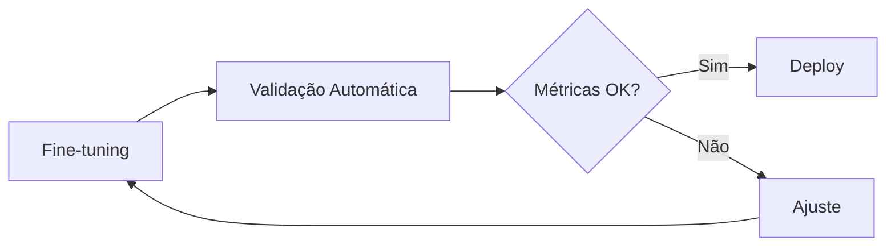

# Observações e Pontos de Atenção - Projeto LlamaFlow

## 1. Complexidade da Integração n8n-Nextflow

### Desafios Identificados
- **Monitoramento Assíncrono**: O pipeline Nextflow pode demorar horas para completar, necessitando um sistema robusto de monitoramento assíncrono
- **Estado do Pipeline**: Necessidade de manter o estado do pipeline entre diferentes execuções
- **Tratamento de Falhas**: Gestão de falhas em diferentes pontos do pipeline

### Soluções Propostas
1. **Sistema de Monitoramento**:
   - Implementar um sistema de heartbeat para verificar o status do pipeline
   - Criar endpoints específicos para status updates
   - Utilizar um banco de dados (como Redis ou PostgreSQL) para manter o estado

2. **Webhooks e Callbacks**:
   - Configurar webhooks no Nextflow para notificar o n8n sobre eventos importantes
   - Implementar retry policies para chamadas falhas
   - Criar um sistema de log detalhado para debugging

3. **Arquitetura de Comunicação**:
```
n8n (Orquestrador) -> API Gateway -> Nextflow
     ^                                  |
     |                                  v
     +---- Message Queue <---- Status Updates
```

## 2. Recursos Computacionais

### Requisitos Mínimos
1. **CPU**:
   - Mínimo: 8 cores
   - Recomendado: 16+ cores
   - Tipo: AMD EPYC ou Intel Xeon recentes

2. **RAM**:
   - Mínimo: 32GB
   - Recomendado: 64GB+
   - Swap: 2x RAM

3. **GPU**:
   - Tipo: NVIDIA
   - Memória: 16GB+ VRAM
   - Arquitetura: Ampere ou superior
   - Quantidade: 1-4 dependendo do tamanho do modelo

4. **Armazenamento**:
   - Sistema: 256GB SSD NVMe
   - Dados: 1TB+ SSD NVMe
   - Modelos: 2TB+ (pode ser HDD)

### Otimizações
1. **Técnicas de Otimização de Memória**:
   - Gradient checkpointing
   - Mixed precision training
   - Model parallelism
   - LoRA para redução de parâmetros treináveis

2. **Distribuição de Carga**:
   - Kubernetes para orquestração de recursos
   - Auto-scaling baseado em demanda
   - Priorização de jobs

## 3. Segurança

### Autenticação e Autorização
1. **API Keys e Tokens**:
   - Rotação automática de chaves
   - Diferentes níveis de acesso
   - Monitoramento de uso

2. **Armazenamento Seguro**:
   - Uso de cofre de senhas (HashiCorp Vault)
   - Criptografia em repouso
   - Segregação de ambientes

3. **Rede e Comunicação**:
   - VPC para isolamento
   - SSL/TLS para todas as comunicações
   - Firewall e regras de acesso

### Proteção de Dados
1. **Dados de Treinamento**:
   - Anonimização automática
   - Controle de acesso granular
   - Logs de auditoria

2. **Modelos Treinados**:
   - Versionamento criptografado
   - Backup automático
   - Políticas de retenção

## 4. Validação de Modelos

### Métricas de Avaliação
1. **Métricas Quantitativas**:
   - Perplexity
   - ROUGE scores
   - BLEU scores
   - BERTScore
   - Tempo de inferência

2. **Métricas Qualitativas**:
   - Human evaluation
   - A/B testing
   - Feedback do usuário

### Pipeline de Validação
1. **Testes Automatizados**:


2. **Conjunto de Dados de Teste**:
   - Test set separado
   - Casos de borda
   - Exemplos adversariais

3. **Monitoramento Contínuo**:
   - Drift detection
   - Performance metrics
   - Resource utilization

## 5. Gestão de Versões

### Versionamento de Código
1. **Estratégia de Branches**:
```
main
├── develop
│   ├── feature/
│   ├── bugfix/
│   └── hotfix/
└── release/
```

2. **Convenções de Commit**:
```
feat: nova funcionalidade
fix: correção de bug
docs: documentação
style: formatação
refactor: refatoração
test: testes
chore: manutenção
```

### Versionamento de Modelos
1. **Estrutura**:
```
models/
├── base/
│   └── llama-7b/
├── fine-tuned/
│   ├── v1.0.0/
│   └── v1.1.0/
└── experiments/
    └── lora-adapters/
```

2. **Metadados**:
   - Parâmetros de treinamento
   - Dataset usado
   - Métricas de performance
   - Hardware utilizado
   - Tempo de treinamento

## 6. Dependências

### Versões Específicas
1. **Core Components**:
```yaml
n8n: "1.19.0"
nextflow: "23.10.0"
docker: "24.0.7"
kubernetes: "1.28.0"
```

2. **Python Packages**:
```yaml
transformers: "4.36.0"
torch: "2.1.0"
datasets: "2.15.0"
evaluate: "0.4.0"
accelerate: "0.25.0"
```

3. **Infrastructure**:
```yaml
minio: "RELEASE.2023-12-23T07-19-11Z"
postgresql: "16.1"
redis: "7.2.3"
```

### Gestão de Dependências
1. **Containerização**:
   - Base images versionadas
   - Multi-stage builds
   - Dependency scanning

2. **Ambiente Virtual**:
   - Poetry para Python
   - pnpm para Node.js
   - Gradle para Java

3. **Updates**:
   - Dependabot configuration
   - Security updates
   - Changelog tracking

## Recomendações Finais

1. **Documentação**:
   - API documentation (OpenAPI/Swagger)
   - Architecture diagrams
   - Runbooks para operações
   - Guias de troubleshooting

2. **Monitoramento**:
   - Prometheus + Grafana
   - ELK Stack para logs
   - Alerting system
   - Performance metrics

3. **CI/CD**:
   - GitHub Actions
   - Automated testing
   - Quality gates
   - Deployment strategies

4. **Backup e Disaster Recovery**:
   - Backup automation
   - Recovery procedures
   - Data retention policies
   - Failover strategies
